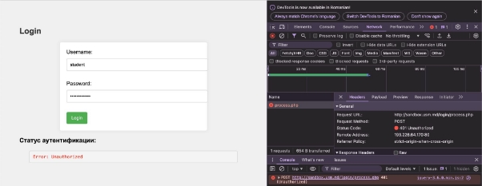
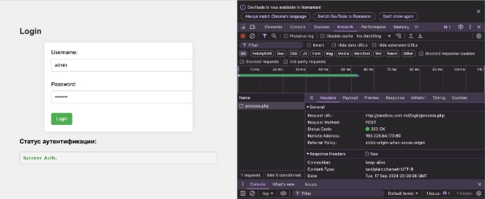

**UNIVERSITATEA DE STAT DIN MOLDOVA
FACULTATEA „MATEMATICĂ ŞI INFORMATICĂ” DEPARTAMENTUL “INFORMATICĂ”**

*Framework*

\_\_\_\_\_\_\_\_\_\_\_\_\_\_\_\_\_\_\_\_\_\_\_\_\_\_\_\_\_\_\_\_\_\_\_\_\_\_\_\_\_\_\_\_\_\_\_\_\_\_\_\_\_\_\_\_\_\_\_\_

**Realizat :** Crangaci Sabina **Grupa:** IA2201

**Verificat:** Nichita Nartea

Chişinău 2024

1. Partea teoretică
1. Scopul

Scopul acestei lucrări de laborator este studierea principiilor de bază ale protocolului HTTP

2. Condițiile

Sarcina nr.1. Analiza cererilor HTTP

1. Accesați site-ul <http://sandbox.usm.md/login>.
1. Deschideți fila Network în instrumentele pentru dezvoltatori ale browserului.
1. Introduceți date incorecte pentru autentificare
1. Analizați cererile care au fost trimise către server.
1. Răspundeți la următoarele întrebări :
   1. Ce metodă HTTP a fost utilizată pentru a trimite cererea?
   1. Ce anteturi au fost trimise în cerere?
   1. Ce parametri au fost trimiși în cerere?
   1. Ce cod de stare a fost returnat de server?
   1. Ce anteturi au fost trimise în răspuns?
1. Repetați pașii 3-5, introducând date corecte pentru autentificare (username- admin, password- password)

Sarcina nr. 2. Crearea cererilor HTTP

1. Scrieți o cerere de tip GET către server la adresa [~~http://sandbox.com~~](http://sandbox.com) , indicând în antetul User-Agent numele și prenumele dvs.
1. Scrieți o cerere de tip POST către server la adresa http://sandbox.com/cars, indicând în corpul cererii următorii parametri:
- make: Toyota
- model: Corolla
- year: 2020
3. Scrieți o cerere de tip PUT către server la adresa

   http://sandbox.com/cars/1,indicând în antetul User-Agent numele și

   prenumele dvs., în antetul Content-Type valoarea application/json, iar în corpul cererii următorii parametri: json { "make": "Toyota", "model": "Corolla", "year": 2021 }

4. Scrieți unul dintre posibilele răspunsuri ale serverului la cererea anterioară. http POST /cars HTTP/1.1 Host: sandbox.com Content-Type: application/json
4. Scrieți unul dintre posibilele răspunsuri ale serverului la cererea anterioară. http POST /cars HTTP/1.1 Host: sandbox.com Content-Type: application/json User-Agent: John Doe model=Corolla&make=Toyota&year=2020 Presupuneți situațiile în care serverul poate returna codurile de stare HTTP 200, 201, 400, 401, 403, 404, 500.
6. Scrieți o cerere de tip DELETE la alegerea dvs. și să explicați de ce, în acest caz, este potrivit să utilizați metoda DELETE.

Sarcina nr. 3. Sarcina suplimentară. HTTP\_Quest TIP

Parcurgeți quest-ul trimițând cereri către server.

1. Trimiteți o cerere de tip POST către server la adresa http://sandbox.usm.md/quest,indicând în antetul User-Agent numele și prenumele dvs. (De exemplu, User-Agent: John Doe). http POST /quest HTTP/1.1 Host: sandbox.usm.md User-Agent: John Doe curl: bash curl -X POST http://sandbox.usm.md/quest -H "User-Agent: John Doe"
1. Urmați instrucțiunile de pe server, îndeplinindu-le în ordine.
1. La finalul quest-ului, vi se va afișa un cuvânt secret, pe care va trebui să-l includeți în

   raport.

Notă *pentru sarcina nr. 3*: 1. Folosiți instrumentul curl, postman sau orice alt instrument pentru a trimite cererile. 2. Puteți relua quest-ul executând din nou primul pas.

3. Întrebări de autoevaluare
1. Ce este protocolul HTTP?
1. Pentru ce folosim antetul User-Agent?
1. Care este diferența dintre metodele PUT și PATCH?
2. Partea practică

Sarcina nr.1. Analiza cererilor HTTP

*fig.1.*

În *fig.1.* au fost introduse datele incorecte

1) Ce metodă HTTP a fost utilizată pentru a trimite cererea?

Metoda HTTP utilizată pentru a trimite cererea de autentificare este POST. Aceasta metodă este folosită pentru a trimite date către server, mai ales când se transmit informații sensibile, cum ar fi datele de autentificare (username și password).

2) Ce anteturi au fost trimise în cerere?

content-type: application/x-www-form-urlencoded; charset=UTF-8

user-agent: Mozilla/5.0 (Macintosh; Intel Mac OS X 10\_15\_7) AppleWebKit/537.36 (KHTML, like Gecko) Chrome/128.0.0.0 Safari/537.36

accept: \*/\*

host: sandbox.usm.md

3) Ce parametri au fost trimiși în cerere?

username: student password: studentpass

4) Ce cod de stare a fost returnat de server?

A fost returnat codul de stare 401 Unauthorized

5) Ce anteturi au fost trimise în răspuns?

content-type: text/plain;charset=UTF-8

user-agent: Mozilla/5.0 (Macintosh; Intel Mac OS X 10\_15\_7) AppleWebKit/537.36 (KHTML, like Gecko) Chrome/128.0.0.0 Safari/537.36

accept: \*/\*

host: sandbox.usm.md

*fig.2.*

În *fig.2.* au fost introduse datele incorecte

1) Ce metodă HTTP a fost utilizată pentru a trimite cererea?

Metoda HTTP utilizată pentru a trimite cererea de autentificare este POST. Aceasta metodă este folosită pentru a trimite date către server, mai ales când se transmit informații sensibile, cum ar fi datele de autentificare (username și password).

2) Ce anteturi au fost trimise în cerere?

content-type: application/x-www-form-urlencoded; charset=UTF-8

user-agent: Mozilla/5.0 (Macintosh; Intel Mac OS X 10\_15\_7) AppleWebKit/537.36 (KHTML, like Gecko) Chrome/128.0.0.0 Safari/537.36

accept: \*/\*

host: sandbox.usm.md

3) Ce parametri au fost trimiși în cerere?

username: admin password: password

4) Ce cod de stare a fost returnat de server?

A fost returnat codul de stare 200 OK

5) Ce anteturi au fost trimise în răspuns?

content-type: application/x-www-form-urlencoded; charset=UTF-8

user-agent: Mozilla/5.0 (Macintosh; Intel Mac OS X 10\_15\_7) AppleWebKit/537.36 (KHTML, like Gecko) Chrome/128.0.0.0 Safari/537.36

accept: \*/\*

host: sandbox.usm.md

Sarcina nr. 2. Crearea cererilor HTTP

1) Cerere GET

GET / HTTP/1.1

Host: sandbox.com

User-Agent: Crangaci Sabina

2) Cerere POST

POST /cars HTTP/1.1

Host: sandbox.com

Content-Type: application/x-www-form-urlencoded make=Toyota&model=Corolla&year=2020

3) Cerere PUT

PUT /cars/1 HTTP/1.1

Host: sandbox.com User-Agent: Crangaci Sabina Content-Type: application/json {

"make": "Toyota",

"model": "Corolla",

"year": 2021

}

4) Posibile răspunsuri
- Cerere PUT

HTTP/1.1 200 OK Content-Type: application/json {

"id": 1,

"make": "Toyota",

"model": "Corolla",

"year": 2021

}

- Cerere POST

HTTP/1.1 201 Created Content-Type: application/json {

"id": 1,

"make": "Toyota",

"model": "Corolla",

"year": 2020

}

Situații în care serverul poate returna coduri de stare HTTP

- **200 OK**: Cererea a fost procesată cu succes..
- **201 Created**: Cererea POST a fost procesată cu succes și a fost creată o nouă resursă.
- **400 Bad Request**: Cererea este invalidă, de exemplu, parametrii lipsă sau format incorect.
- **401 Unauthorized**: Autentificarea este necesară și a eșuat sau nu a fost furnizată.
- **403 Forbidden**: Serverul a înțeles cererea, dar refuză să o autorizeze.
- **404 Not Found**: Resursa solicitată nu a fost găsită pe server.
- **500 InternalServer Error**: Serverul a întâmpinat o eroare neașteptată care l-a împiedicat să proceseze cererea.

\6) Cerere DELETE DELETE /cars/1 HTTP/1\.1 Host: sandbox\.com User-Agent: Crangaci Sabina

Metoda DELETE este potrivită pentru a șterge o resursă specificată de pe server.De exemplu, dacă dorim să ștergem date, utilizăm metoda DELETE pentru a indica serverului să elimine acea resursă.

Sarcina nr. 3. Sarcina suplimentară. HTTP\_Quest

9
